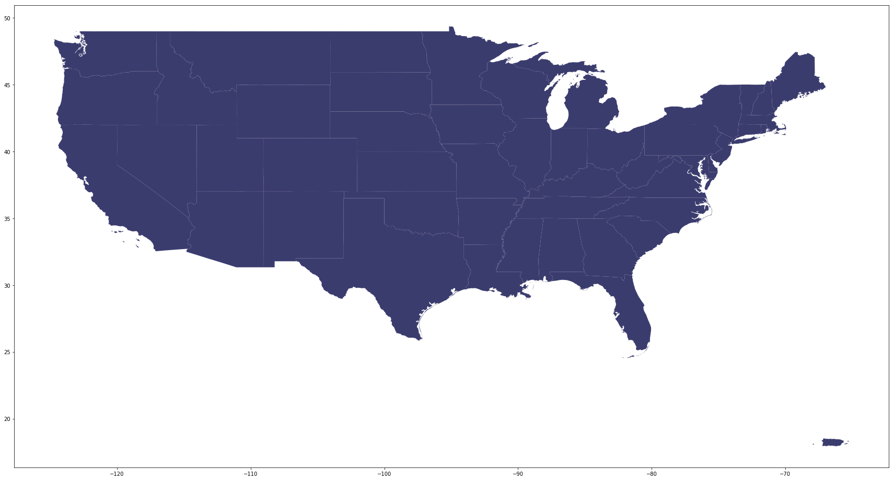
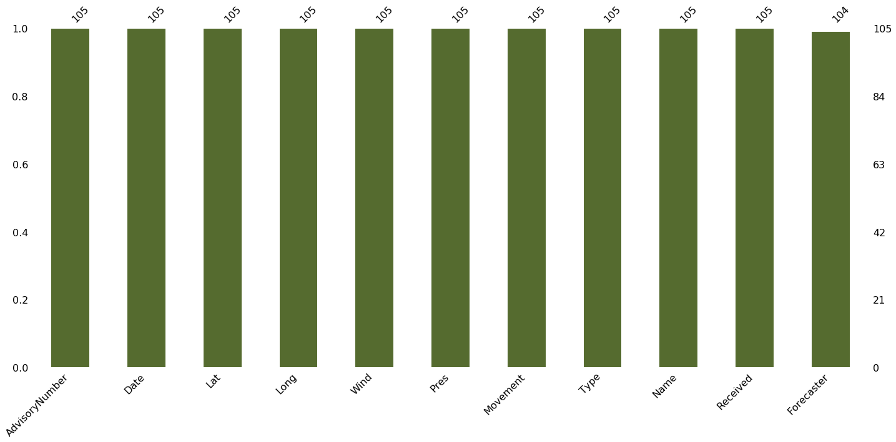
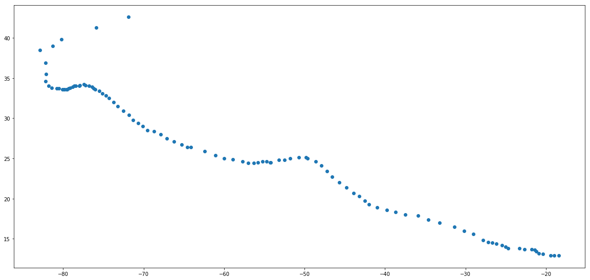
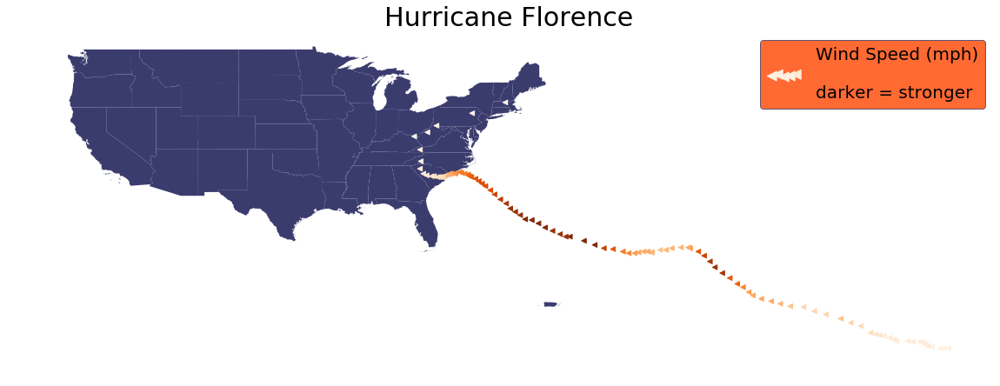

<!--
---

[TOC]
-->
---

**Foreword**

Notes.

---

# Geospatial Data in Python

Install all the packages.  
Some packages are pre-requisites to the others: to install GeoPandas, it requires Shapely, and to install Shapely, RTree, GDAL, and Fiona should be installed first.

- RTree: a ctypes Python wrapper of libspatialindex that provides a number of advanced spatial indexing features;
- GDAL: translator library for raster and vector geospatial data formats;
- Fiona: Fiona reads and writes spatial data files;
- Shapely: Geometric objects, predicates, and operations;
- GeoPandas: extends the datatypes used by pandas to allow spatial operations on geometric types;
- PySAL: a library of spatial analysis functions written in Python intended to support the development of high-level applications;
- Missingno: Missing data visualization module for Python.

# The dataset

We take hurricane [Florence](http://flhurricane.com/cyclone/stormhistory.php?storm=6&year=2018)'s trajectory for plotting points on a map of the [US States](http://eric.clst.org/tech/usgeojson/).


```python
# Loading the packages
import geopandas

import numpy as np
import pandas as pd

from shapely.geometry import Point

import missingno as msn

import seaborn as sns
import matplotlib.pyplot as plt
%matplotlib inline
```

Let's look at the geospatial file from the US States (a GeoJSON file).


```python
# Loading the file
country = geopandas.read_file("data/gz_2010_us_040_00_5m.json")
country.head(3)
```


<div>
<style scoped>
    .dataframe tbody tr th:only-of-type {
        vertical-align: middle;
    }

    .dataframe tbody tr th {
        vertical-align: top;
    }

    .dataframe thead th {
        text-align: right;
    }
</style>
<table border="1" class="dataframe">
  <thead>
    <tr style="text-align: right;">
      <th></th>
      <th>GEO_ID</th>
      <th>STATE</th>
      <th>NAME</th>
      <th>LSAD</th>
      <th>CENSUSAREA</th>
      <th>geometry</th>
    </tr>
  </thead>
  <tbody>
    <tr>
      <th>0</th>
      <td>0400000US01</td>
      <td>01</td>
      <td>Alabama</td>
      <td></td>
      <td>50645.326</td>
      <td>(POLYGON ((-88.124658 30.28364, -88.0868119999...</td>
    </tr>
    <tr>
      <th>1</th>
      <td>0400000US02</td>
      <td>02</td>
      <td>Alaska</td>
      <td></td>
      <td>570640.950</td>
      <td>(POLYGON ((-166.10574 53.988606, -166.075283 5...</td>
    </tr>
    <tr>
      <th>2</th>
      <td>0400000US04</td>
      <td>04</td>
      <td>Arizona</td>
      <td></td>
      <td>113594.084</td>
      <td>POLYGON ((-112.538593 37.000674, -112.534545 3...</td>
    </tr>
  </tbody>
</table>
</div>


It is `GeoDataFrame`, which has all the regular characteristics of a Pandas `DataFrame`.


```python
# Printing
type(country)
```


    geopandas.geodataframe.GeoDataFrame


The column (`geometry`) containing the coordinates is a `GeoSeries`.


```python
# Printing
type(country.geometry)
```


    geopandas.geoseries.GeoSeries


Each value in the `GeoSeries` is a Shapely Object: a point, a segment, a polygon (and a multipolygon).  
Each object can represent something: a point for a building, a segment for a street, a polygon for acity, and multipolygon for a country with multiple borders inside.  
For more information about each Geometric object, consult this [article](https://shapely.readthedocs.io/en/stable/manual.html#geometric-objects).


```python
# Printing
type(country.geometry[0])
```


    shapely.geometry.multipolygon.MultiPolygon


Similar to a Pandas `DataFrame`, a `GeoDataFrame` can be plotted.


```python
# Plotting the multipolygon
country.plot();
```


As we may see, the US map is relatively small compared to the frame.  
It's because the information includes Alaska, Hawaii, and Puerto Rico.  
For this tutorial purpose, we can exclude Alaska and Hawaii as the hurricane did not go anywhere near those two states.  
We can also add the figure size and colour to customize the plot


```python
# Plotting
# Excluding Alaska and Hawaii with a conditional selection
country[country['NAME'].isin(['Alaska','Hawaii']) == False].plot(figsize=(30,20),
                                                                 color='#3B3C6E');
```





```python
# Loading the hurricane data
florence = pd.read_csv('data/florence.csv')
florence.head(3)
```


<div>
<style scoped>
    .dataframe tbody tr th:only-of-type {
        vertical-align: middle;
    }

    .dataframe tbody tr th {
        vertical-align: top;
    }

    .dataframe thead th {
        text-align: right;
    }
</style>
<table border="1" class="dataframe">
  <thead>
    <tr style="text-align: right;">
      <th></th>
      <th>AdvisoryNumber</th>
      <th>Date</th>
      <th>Lat</th>
      <th>Long</th>
      <th>Wind</th>
      <th>Pres</th>
      <th>Movement</th>
      <th>Type</th>
      <th>Name</th>
      <th>Received</th>
      <th>Forecaster</th>
    </tr>
  </thead>
  <tbody>
    <tr>
      <th>0</th>
      <td>1</td>
      <td>08/30/2018 11:00</td>
      <td>12.9</td>
      <td>18.4</td>
      <td>30</td>
      <td>1007</td>
      <td>W at 12 MPH (280 deg)</td>
      <td>Potential Tropical Cyclone</td>
      <td>Six</td>
      <td>08/30/2018 10:45</td>
      <td>Avila</td>
    </tr>
    <tr>
      <th>1</th>
      <td>1A</td>
      <td>08/30/2018 14:00</td>
      <td>12.9</td>
      <td>19.0</td>
      <td>30</td>
      <td>1007</td>
      <td>W at 12 MPH (280 deg)</td>
      <td>Potential Tropical Cyclone</td>
      <td>Six</td>
      <td>08/30/2018 13:36</td>
      <td>Avila</td>
    </tr>
    <tr>
      <th>2</th>
      <td>2</td>
      <td>08/30/2018 17:00</td>
      <td>12.9</td>
      <td>19.4</td>
      <td>30</td>
      <td>1007</td>
      <td>W at 9 MPH (280 deg)</td>
      <td>Potential Tropical Cyclone</td>
      <td>Six</td>
      <td>08/30/2018 16:36</td>
      <td>Avila</td>
    </tr>
  </tbody>
</table>
</div>


# Exploratory Data Analysis

The first thing to do is EDA:

- Check the information, data type;
- Find out about missing values;
- Explore the descriptive statistics.


```python
# Printing
florence.info()
```

    <class 'pandas.core.frame.DataFrame'>
    RangeIndex: 105 entries, 0 to 104
    Data columns (total 11 columns):
    AdvisoryNumber    105 non-null object
    Date              105 non-null object
    Lat               105 non-null float64
    Long              105 non-null float64
    Wind              105 non-null int64
    Pres              105 non-null int64
    Movement          105 non-null object
    Type              105 non-null object
    Name              105 non-null object
    Received          105 non-null object
    Forecaster        104 non-null object
    dtypes: float64(2), int64(2), object(7)
    memory usage: 9.1+ KB


Checking missing values using the missingno package.  
There is only one missing value in column `Forecaster` which we don't need.  
So we can ignore it.


```python
# The package alias is msn (missingno)
# Printing
msn.bar(florence,
        color='darkolivegreen');
```





```python
# Descriptive statistics (numerical columns, Series, fields or features only)
# Printing
florence.describe()
```


<div>
<style scoped>
    .dataframe tbody tr th:only-of-type {
        vertical-align: middle;
    }

    .dataframe tbody tr th {
        vertical-align: top;
    }

    .dataframe thead th {
        text-align: right;
    }
</style>
<table border="1" class="dataframe">
  <thead>
    <tr style="text-align: right;">
      <th></th>
      <th>Lat</th>
      <th>Long</th>
      <th>Wind</th>
      <th>Pres</th>
    </tr>
  </thead>
  <tbody>
    <tr>
      <th>count</th>
      <td>105.000000</td>
      <td>105.000000</td>
      <td>105.000000</td>
      <td>105.000000</td>
    </tr>
    <tr>
      <th>mean</th>
      <td>25.931429</td>
      <td>56.938095</td>
      <td>74.428571</td>
      <td>981.571429</td>
    </tr>
    <tr>
      <th>std</th>
      <td>7.975917</td>
      <td>20.878865</td>
      <td>36.560765</td>
      <td>22.780667</td>
    </tr>
    <tr>
      <th>min</th>
      <td>12.900000</td>
      <td>18.400000</td>
      <td>25.000000</td>
      <td>939.000000</td>
    </tr>
    <tr>
      <th>25%</th>
      <td>18.900000</td>
      <td>41.000000</td>
      <td>40.000000</td>
      <td>956.000000</td>
    </tr>
    <tr>
      <th>50%</th>
      <td>25.100000</td>
      <td>60.000000</td>
      <td>70.000000</td>
      <td>989.000000</td>
    </tr>
    <tr>
      <th>75%</th>
      <td>33.600000</td>
      <td>76.400000</td>
      <td>105.000000</td>
      <td>1002.000000</td>
    </tr>
    <tr>
      <th>max</th>
      <td>42.600000</td>
      <td>82.900000</td>
      <td>140.000000</td>
      <td>1008.000000</td>
    </tr>
  </tbody>
</table>
</div>


We only need the `date`, the coordinates: `lat` (latitude) and `long` (longitude), `Wind` speed, `Pres`sure, and `Name`.  
`Movement` and `Type` are optional, but the rest can be dropped.


```python
# Droping all unused features
florence = florence.drop(['AdvisoryNumber', 'Forecaster', 'Received'],
                         axis=1)

# Printing
florence.head(3)
```


<div>
<style scoped>
    .dataframe tbody tr th:only-of-type {
        vertical-align: middle;
    }

    .dataframe tbody tr th {
        vertical-align: top;
    }

    .dataframe thead th {
        text-align: right;
    }
</style>
<table border="1" class="dataframe">
  <thead>
    <tr style="text-align: right;">
      <th></th>
      <th>Date</th>
      <th>Lat</th>
      <th>Long</th>
      <th>Wind</th>
      <th>Pres</th>
      <th>Movement</th>
      <th>Type</th>
      <th>Name</th>
    </tr>
  </thead>
  <tbody>
    <tr>
      <th>0</th>
      <td>08/30/2018 11:00</td>
      <td>12.9</td>
      <td>18.4</td>
      <td>30</td>
      <td>1007</td>
      <td>W at 12 MPH (280 deg)</td>
      <td>Potential Tropical Cyclone</td>
      <td>Six</td>
    </tr>
    <tr>
      <th>1</th>
      <td>08/30/2018 14:00</td>
      <td>12.9</td>
      <td>19.0</td>
      <td>30</td>
      <td>1007</td>
      <td>W at 12 MPH (280 deg)</td>
      <td>Potential Tropical Cyclone</td>
      <td>Six</td>
    </tr>
    <tr>
      <th>2</th>
      <td>08/30/2018 17:00</td>
      <td>12.9</td>
      <td>19.4</td>
      <td>30</td>
      <td>1007</td>
      <td>W at 9 MPH (280 deg)</td>
      <td>Potential Tropical Cyclone</td>
      <td>Six</td>
    </tr>
  </tbody>
</table>
</div>


It is important to check out the longitude and latitude.  
Here the longitude is west.  
Add `-` to the `Long` values to correctly plot the data.  
The US are west of the Greenwich meridian (0 degree).  
Everything east of the 0 degree is positive, everything west is negative.  
The same goes for the northern/southern hemispheres.


```python
# Modifying
florence['Long'] = 0 - florence['Long']

# Printing
florence.head(3)
```


<div>
<style scoped>
    .dataframe tbody tr th:only-of-type {
        vertical-align: middle;
    }

    .dataframe tbody tr th {
        vertical-align: top;
    }

    .dataframe thead th {
        text-align: right;
    }
</style>
<table border="1" class="dataframe">
  <thead>
    <tr style="text-align: right;">
      <th></th>
      <th>Date</th>
      <th>Lat</th>
      <th>Long</th>
      <th>Wind</th>
      <th>Pres</th>
      <th>Movement</th>
      <th>Type</th>
      <th>Name</th>
    </tr>
  </thead>
  <tbody>
    <tr>
      <th>0</th>
      <td>08/30/2018 11:00</td>
      <td>12.9</td>
      <td>-18.4</td>
      <td>30</td>
      <td>1007</td>
      <td>W at 12 MPH (280 deg)</td>
      <td>Potential Tropical Cyclone</td>
      <td>Six</td>
    </tr>
    <tr>
      <th>1</th>
      <td>08/30/2018 14:00</td>
      <td>12.9</td>
      <td>-19.0</td>
      <td>30</td>
      <td>1007</td>
      <td>W at 12 MPH (280 deg)</td>
      <td>Potential Tropical Cyclone</td>
      <td>Six</td>
    </tr>
    <tr>
      <th>2</th>
      <td>08/30/2018 17:00</td>
      <td>12.9</td>
      <td>-19.4</td>
      <td>30</td>
      <td>1007</td>
      <td>W at 9 MPH (280 deg)</td>
      <td>Potential Tropical Cyclone</td>
      <td>Six</td>
    </tr>
  </tbody>
</table>
</div>


Let's combine the latitude and longitude to create coordinates, which will subsequently be turned into a `GeoSeries` for visualization purpose.


```python
# Combining
florence['coordinates'] = florence[['Long', 'Lat']].values.tolist()

# Printing
florence.head(3)
```


<div>
<style scoped>
    .dataframe tbody tr th:only-of-type {
        vertical-align: middle;
    }

    .dataframe tbody tr th {
        vertical-align: top;
    }

    .dataframe thead th {
        text-align: right;
    }
</style>
<table border="1" class="dataframe">
  <thead>
    <tr style="text-align: right;">
      <th></th>
      <th>Date</th>
      <th>Lat</th>
      <th>Long</th>
      <th>Wind</th>
      <th>Pres</th>
      <th>Movement</th>
      <th>Type</th>
      <th>Name</th>
      <th>coordinates</th>
    </tr>
  </thead>
  <tbody>
    <tr>
      <th>0</th>
      <td>08/30/2018 11:00</td>
      <td>12.9</td>
      <td>-18.4</td>
      <td>30</td>
      <td>1007</td>
      <td>W at 12 MPH (280 deg)</td>
      <td>Potential Tropical Cyclone</td>
      <td>Six</td>
      <td>[-18.4, 12.9]</td>
    </tr>
    <tr>
      <th>1</th>
      <td>08/30/2018 14:00</td>
      <td>12.9</td>
      <td>-19.0</td>
      <td>30</td>
      <td>1007</td>
      <td>W at 12 MPH (280 deg)</td>
      <td>Potential Tropical Cyclone</td>
      <td>Six</td>
      <td>[-19.0, 12.9]</td>
    </tr>
    <tr>
      <th>2</th>
      <td>08/30/2018 17:00</td>
      <td>12.9</td>
      <td>-19.4</td>
      <td>30</td>
      <td>1007</td>
      <td>W at 9 MPH (280 deg)</td>
      <td>Potential Tropical Cyclone</td>
      <td>Six</td>
      <td>[-19.4, 12.9]</td>
    </tr>
  </tbody>
</table>
</div>


```python
# Changing the coordinates into GeoPoint
florence['coordinates'] = florence['coordinates'].apply(Point)

# Printing
florence.head(3)
```


<div>
<style scoped>
    .dataframe tbody tr th:only-of-type {
        vertical-align: middle;
    }

    .dataframe tbody tr th {
        vertical-align: top;
    }

    .dataframe thead th {
        text-align: right;
    }
</style>
<table border="1" class="dataframe">
  <thead>
    <tr style="text-align: right;">
      <th></th>
      <th>Date</th>
      <th>Lat</th>
      <th>Long</th>
      <th>Wind</th>
      <th>Pres</th>
      <th>Movement</th>
      <th>Type</th>
      <th>Name</th>
      <th>coordinates</th>
    </tr>
  </thead>
  <tbody>
    <tr>
      <th>0</th>
      <td>08/30/2018 11:00</td>
      <td>12.9</td>
      <td>-18.4</td>
      <td>30</td>
      <td>1007</td>
      <td>W at 12 MPH (280 deg)</td>
      <td>Potential Tropical Cyclone</td>
      <td>Six</td>
      <td>POINT (-18.4 12.9)</td>
    </tr>
    <tr>
      <th>1</th>
      <td>08/30/2018 14:00</td>
      <td>12.9</td>
      <td>-19.0</td>
      <td>30</td>
      <td>1007</td>
      <td>W at 12 MPH (280 deg)</td>
      <td>Potential Tropical Cyclone</td>
      <td>Six</td>
      <td>POINT (-19 12.9)</td>
    </tr>
    <tr>
      <th>2</th>
      <td>08/30/2018 17:00</td>
      <td>12.9</td>
      <td>-19.4</td>
      <td>30</td>
      <td>1007</td>
      <td>W at 9 MPH (280 deg)</td>
      <td>Potential Tropical Cyclone</td>
      <td>Six</td>
      <td>POINT (-19.4 12.9)</td>
    </tr>
  </tbody>
</table>
</div>


Checking the type of the `florence` and column `coordinates`: it is a `DataFrame` and a `Series`.


```python
# Printing
type(florence)
```


    pandas.core.frame.DataFrame


```python
# Printing
type(florence['coordinates'])
```


    pandas.core.series.Series


Convert the `DataFrame` into a `GeoDataFrame` and check the types once again: it is a `GeoDataFrame` and `GeoSeries`.


```python
# Converting
florence = geopandas.GeoDataFrame(florence, 
                                  geometry='coordinates')

# Printing
florence.head(3)
```


<div>
<style scoped>
    .dataframe tbody tr th:only-of-type {
        vertical-align: middle;
    }

    .dataframe tbody tr th {
        vertical-align: top;
    }

    .dataframe thead th {
        text-align: right;
    }
</style>
<table border="1" class="dataframe">
  <thead>
    <tr style="text-align: right;">
      <th></th>
      <th>Date</th>
      <th>Lat</th>
      <th>Long</th>
      <th>Wind</th>
      <th>Pres</th>
      <th>Movement</th>
      <th>Type</th>
      <th>Name</th>
      <th>coordinates</th>
    </tr>
  </thead>
  <tbody>
    <tr>
      <th>0</th>
      <td>08/30/2018 11:00</td>
      <td>12.9</td>
      <td>-18.4</td>
      <td>30</td>
      <td>1007</td>
      <td>W at 12 MPH (280 deg)</td>
      <td>Potential Tropical Cyclone</td>
      <td>Six</td>
      <td>POINT (-18.4 12.9)</td>
    </tr>
    <tr>
      <th>1</th>
      <td>08/30/2018 14:00</td>
      <td>12.9</td>
      <td>-19.0</td>
      <td>30</td>
      <td>1007</td>
      <td>W at 12 MPH (280 deg)</td>
      <td>Potential Tropical Cyclone</td>
      <td>Six</td>
      <td>POINT (-19 12.9)</td>
    </tr>
    <tr>
      <th>2</th>
      <td>08/30/2018 17:00</td>
      <td>12.9</td>
      <td>-19.4</td>
      <td>30</td>
      <td>1007</td>
      <td>W at 9 MPH (280 deg)</td>
      <td>Potential Tropical Cyclone</td>
      <td>Six</td>
      <td>POINT (-19.4 12.9)</td>
    </tr>
  </tbody>
</table>
</div>


```python
# Printing
type(florence)
```


    geopandas.geodataframe.GeoDataFrame


```python
# Printing
type(florence['coordinates'])
```


    geopandas.geoseries.GeoSeries


Notice that even though it's now a `GeoDataFrame` and a `GeoSeries`, we can still filter the rows.


```python
# Filtering by the Name column
# (a hurricane is of category 6 and lower values are tropical storms)
florence[florence['Name']=='Six']

# Agregating by the Name column
florence.groupby('Name').Type.count()
```


    Name
    FLORENCE     6
    Florence    85
    SIX          4
    Six         10
    Name: Type, dtype: int64


Let's find the average wind speed.


```python
# Printing
print("The average wind speed of Hurricane Florence is {} mph, and it can go up to {} mph maximum".\
      format(round(florence.Wind.mean(),4),
             florence.Wind.max()))
```

    The average wind speed of Hurricane Florence is 74.4286 mph, and it can go up to 140 mph maximum


So the average wind speed of hurricane Florence is 74.43 miles per hour (119.78 km per hour) and the maximum is 140 miles per hour (225.308 km per hour).  
To imagine how scary this wind speed is, the Beaufort Wind Scale, developed by U.K Royal Navy, shows the appearance of wind effects on the water and on land.  
With the speed of 48 to 55 miles per hours, it can already break and uproot trees, and cause "considerable structural damage".

# Visualization

A `GeoDataFrame` also has a `plot` method.


```python
# Plotting
florence.plot(figsize=(20,10));
```





Because this `GeoDataFrame` only have coordinates information (location) of some points in time, we can only plot the position on a blank map.  
Let's plot the hurricane position on a US map to see where Florence transited and how strong the wind was at that time.  
We use a US States map (data we loaded at the beginning) as the background and we overlay Florence's  positions on top.


```python
# Plotting the US map
fig, ax = plt.subplots(1, figsize=(30,20))
base = country[country['NAME'].isin(['Alaska','Hawaii']) == False].plot(ax=ax,
                                                                        color='#3B3C6E')

# Plotting the hurricane position
florence.plot(ax=base,
              color='darkred',
              marker="*",
              markersize=20);
```


```python
# Improving
fig, ax = plt.subplots(1, figsize=(20,20))
base = country[country['NAME'].isin(['Alaska','Hawaii']) == False].plot(ax=ax, color='#3B3C6E')

florence.plot(ax=base,
              column='Wind',
              marker="<",
              markersize=30,
              cmap='Oranges',
              label="Wind speed(mph)")

_ = ax.axis('off')
plt.legend(labels=["Wind Speed (mph)\n\ndarker = stronger"],
           fontsize=20,
           facecolor='orangered',
           markerscale=2,
           loc='best',
           scatterpoints=5,
           fancybox=True,
           edgecolor='#3B3C6E')
ax.set_title("Hurricane Florence",
             fontsize=30)

# Saving
plt.savefig('Hurricane_footage.png',bbox_inches='tight');
```





So the hurricane was strongest when it is offshore, near the east coast.  
As it approached the land, the hurricane started losing its strength, but with wind speeds ranging 60 to 77 miles per hour can still make horrible damages.

For more, consult [Python Geospatial Development Essentials](https://www.packtpub.com/application-development/python-geospatial-development-essentials/?utm_source=VK-thepythongischallenge&utm_medium=referral&utm_campaign=1782175407).
