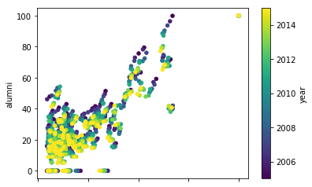
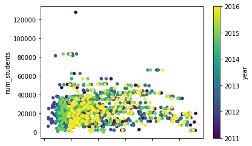
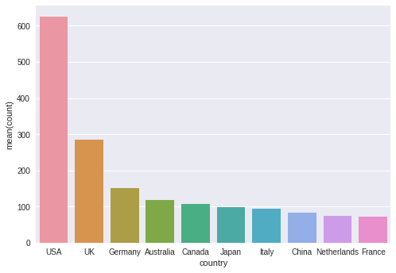
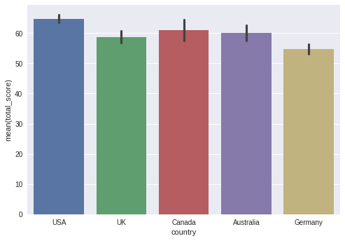
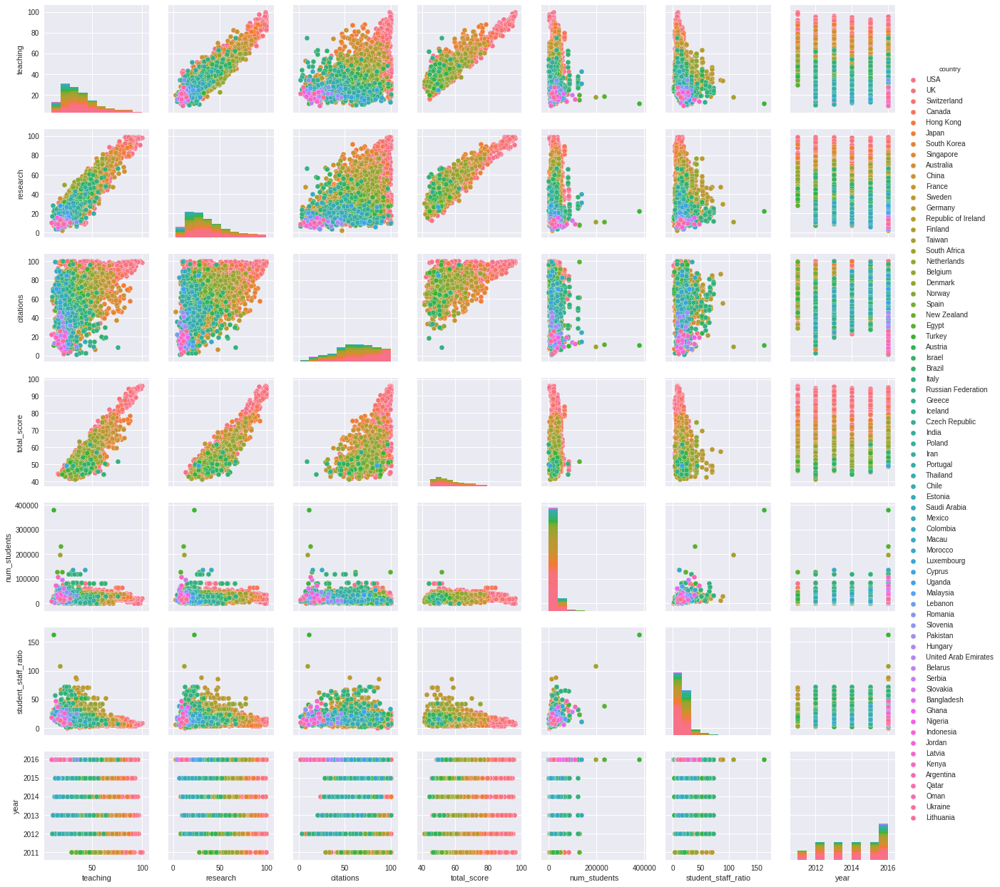
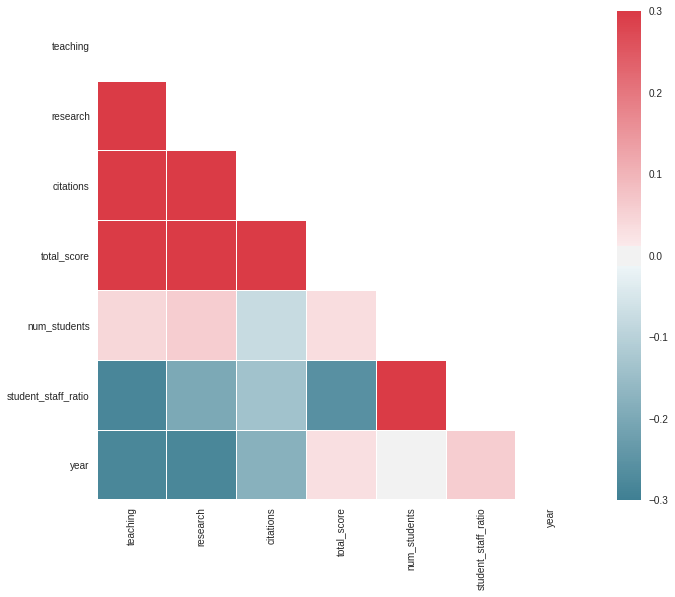

<!--
---

[TOC]
-->
---

**Foreword**

Code snippets and excerpts from the tutorial. Python 3. From DataCamp.
With Jupyter Notebook and the `In [ ]` `Out [ ]` format.

---

# Load and Explore the Data

## The Data

The datasets are downloadable from [Kaggle](https://www.kaggle.com/mylesoneill/world-university-rankings).


```python
%pylab inline
import pandas as pd

# Import Times Higher Education World University Rankings data
# https://www.timeshighereducation.com/world-university-rankings
times_df = pd.read_csv('timesData.csv', thousands=",")

# Import Academic Ranking of World Universities data
# http://www.shanghairanking.com/
shanghai_df = pd.read_csv('shanghaiData.csv')
```

    Populating the interactive namespace from numpy and matplotlib


## Quickly Inspecting the Data


```python
# Return the first rows of `times_df`
times_df.head()
```


<div>
<style>
    .dataframe thead tr:only-child th {
        text-align: right;
    }

    .dataframe thead th {
        text-align: left;
    }

    .dataframe tbody tr th {
        vertical-align: top;
    }
</style>
<table border="1" class="dataframe">
  <thead>
    <tr style="text-align: right;">
      <th></th>
      <th>world_rank</th>
      <th>university_name</th>
      <th>country</th>
      <th>teaching</th>
      <th>international</th>
      <th>research</th>
      <th>citations</th>
      <th>income</th>
      <th>total_score</th>
      <th>num_students</th>
      <th>student_staff_ratio</th>
      <th>international_students</th>
      <th>female_male_ratio</th>
      <th>year</th>
    </tr>
  </thead>
  <tbody>
    <tr>
      <th>0</th>
      <td>1</td>
      <td>Harvard University</td>
      <td>United States of America</td>
      <td>99.7</td>
      <td>72.4</td>
      <td>98.7</td>
      <td>98.8</td>
      <td>34.5</td>
      <td>96.1</td>
      <td>20152.0</td>
      <td>8.9</td>
      <td>25%</td>
      <td>NaN</td>
      <td>2011</td>
    </tr>
    <tr>
      <th>1</th>
      <td>2</td>
      <td>California Institute of Technology</td>
      <td>United States of America</td>
      <td>97.7</td>
      <td>54.6</td>
      <td>98.0</td>
      <td>99.9</td>
      <td>83.7</td>
      <td>96.0</td>
      <td>2243.0</td>
      <td>6.9</td>
      <td>27%</td>
      <td>33 : 67</td>
      <td>2011</td>
    </tr>
    <tr>
      <th>2</th>
      <td>3</td>
      <td>Massachusetts Institute of Technology</td>
      <td>United States of America</td>
      <td>97.8</td>
      <td>82.3</td>
      <td>91.4</td>
      <td>99.9</td>
      <td>87.5</td>
      <td>95.6</td>
      <td>11074.0</td>
      <td>9.0</td>
      <td>33%</td>
      <td>37 : 63</td>
      <td>2011</td>
    </tr>
    <tr>
      <th>3</th>
      <td>4</td>
      <td>Stanford University</td>
      <td>United States of America</td>
      <td>98.3</td>
      <td>29.5</td>
      <td>98.1</td>
      <td>99.2</td>
      <td>64.3</td>
      <td>94.3</td>
      <td>15596.0</td>
      <td>7.8</td>
      <td>22%</td>
      <td>42 : 58</td>
      <td>2011</td>
    </tr>
    <tr>
      <th>4</th>
      <td>5</td>
      <td>Princeton University</td>
      <td>United States of America</td>
      <td>90.9</td>
      <td>70.3</td>
      <td>95.4</td>
      <td>99.9</td>
      <td>-</td>
      <td>94.2</td>
      <td>7929.0</td>
      <td>8.4</td>
      <td>27%</td>
      <td>45 : 55</td>
      <td>2011</td>
    </tr>
  </tbody>
</table>
</div>


```python
# Describe `times_df`
times_df.describe()
```


<div>
<style>
    .dataframe thead tr:only-child th {
        text-align: right;
    }

    .dataframe thead th {
        text-align: left;
    }

    .dataframe tbody tr th {
        vertical-align: top;
    }
</style>
<table border="1" class="dataframe">
  <thead>
    <tr style="text-align: right;">
      <th></th>
      <th>teaching</th>
      <th>research</th>
      <th>citations</th>
      <th>num_students</th>
      <th>student_staff_ratio</th>
      <th>year</th>
    </tr>
  </thead>
  <tbody>
    <tr>
      <th>count</th>
      <td>2603.000000</td>
      <td>2603.000000</td>
      <td>2603.000000</td>
      <td>2544.000000</td>
      <td>2544.000000</td>
      <td>2603.000000</td>
    </tr>
    <tr>
      <th>mean</th>
      <td>37.801498</td>
      <td>35.910257</td>
      <td>60.921629</td>
      <td>23873.758648</td>
      <td>18.445283</td>
      <td>2014.075682</td>
    </tr>
    <tr>
      <th>std</th>
      <td>17.604218</td>
      <td>21.254805</td>
      <td>23.073219</td>
      <td>17675.946877</td>
      <td>11.458698</td>
      <td>1.685733</td>
    </tr>
    <tr>
      <th>min</th>
      <td>9.900000</td>
      <td>2.900000</td>
      <td>1.200000</td>
      <td>462.000000</td>
      <td>0.600000</td>
      <td>2011.000000</td>
    </tr>
    <tr>
      <th>25%</th>
      <td>24.700000</td>
      <td>19.600000</td>
      <td>45.500000</td>
      <td>12637.750000</td>
      <td>11.975000</td>
      <td>2013.000000</td>
    </tr>
    <tr>
      <th>50%</th>
      <td>33.900000</td>
      <td>30.500000</td>
      <td>62.500000</td>
      <td>20851.000000</td>
      <td>16.100000</td>
      <td>2014.000000</td>
    </tr>
    <tr>
      <th>75%</th>
      <td>46.400000</td>
      <td>47.250000</td>
      <td>79.050000</td>
      <td>29991.000000</td>
      <td>21.500000</td>
      <td>2016.000000</td>
    </tr>
    <tr>
      <th>max</th>
      <td>99.700000</td>
      <td>99.400000</td>
      <td>100.000000</td>
      <td>379231.000000</td>
      <td>162.600000</td>
      <td>2016.000000</td>
    </tr>
  </tbody>
</table>
</div>


```python
# Return the first rows of `shanghai_df`
shanghai_df.head()
```


<div>
<style>
    .dataframe thead tr:only-child th {
        text-align: right;
    }

    .dataframe thead th {
        text-align: left;
    }

    .dataframe tbody tr th {
        vertical-align: top;
    }
</style>
<table border="1" class="dataframe">
  <thead>
    <tr style="text-align: right;">
      <th></th>
      <th>world_rank</th>
      <th>university_name</th>
      <th>national_rank</th>
      <th>total_score</th>
      <th>alumni</th>
      <th>award</th>
      <th>hici</th>
      <th>ns</th>
      <th>pub</th>
      <th>pcp</th>
      <th>year</th>
    </tr>
  </thead>
  <tbody>
    <tr>
      <th>0</th>
      <td>1</td>
      <td>Harvard University</td>
      <td>1</td>
      <td>100.0</td>
      <td>100.0</td>
      <td>100.0</td>
      <td>100.0</td>
      <td>100.0</td>
      <td>100.0</td>
      <td>72.4</td>
      <td>2005</td>
    </tr>
    <tr>
      <th>1</th>
      <td>2</td>
      <td>University of Cambridge</td>
      <td>1</td>
      <td>73.6</td>
      <td>99.8</td>
      <td>93.4</td>
      <td>53.3</td>
      <td>56.6</td>
      <td>70.9</td>
      <td>66.9</td>
      <td>2005</td>
    </tr>
    <tr>
      <th>2</th>
      <td>3</td>
      <td>Stanford University</td>
      <td>2</td>
      <td>73.4</td>
      <td>41.1</td>
      <td>72.2</td>
      <td>88.5</td>
      <td>70.9</td>
      <td>72.3</td>
      <td>65.0</td>
      <td>2005</td>
    </tr>
    <tr>
      <th>3</th>
      <td>4</td>
      <td>University of California, Berkeley</td>
      <td>3</td>
      <td>72.8</td>
      <td>71.8</td>
      <td>76.0</td>
      <td>69.4</td>
      <td>73.9</td>
      <td>72.2</td>
      <td>52.7</td>
      <td>2005</td>
    </tr>
    <tr>
      <th>4</th>
      <td>5</td>
      <td>Massachusetts Institute of Technology (MIT)</td>
      <td>4</td>
      <td>70.1</td>
      <td>74.0</td>
      <td>80.6</td>
      <td>66.7</td>
      <td>65.8</td>
      <td>64.3</td>
      <td>53.0</td>
      <td>2005</td>
    </tr>
  </tbody>
</table>
</div>


```python
# Describe `shanghai_df`
shanghai_df.describe()
```


<div>
<style>
    .dataframe thead tr:only-child th {
        text-align: right;
    }

    .dataframe thead th {
        text-align: left;
    }

    .dataframe tbody tr th {
        vertical-align: top;
    }
</style>
<table border="1" class="dataframe">
  <thead>
    <tr style="text-align: right;">
      <th></th>
      <th>total_score</th>
      <th>alumni</th>
      <th>award</th>
      <th>hici</th>
      <th>ns</th>
      <th>pub</th>
      <th>pcp</th>
      <th>year</th>
    </tr>
  </thead>
  <tbody>
    <tr>
      <th>count</th>
      <td>1101.000000</td>
      <td>4896.000000</td>
      <td>4895.00000</td>
      <td>4895.000000</td>
      <td>4875.000000</td>
      <td>4895.000000</td>
      <td>4895.000000</td>
      <td>4897.000000</td>
    </tr>
    <tr>
      <th>mean</th>
      <td>36.383470</td>
      <td>9.161724</td>
      <td>7.69191</td>
      <td>16.221491</td>
      <td>16.078503</td>
      <td>38.254648</td>
      <td>21.242329</td>
      <td>2009.658566</td>
    </tr>
    <tr>
      <th>std</th>
      <td>13.557186</td>
      <td>14.140636</td>
      <td>15.49411</td>
      <td>14.382710</td>
      <td>12.511529</td>
      <td>13.050809</td>
      <td>9.254351</td>
      <td>3.197576</td>
    </tr>
    <tr>
      <th>min</th>
      <td>23.500000</td>
      <td>0.000000</td>
      <td>0.00000</td>
      <td>0.000000</td>
      <td>0.000000</td>
      <td>7.300000</td>
      <td>8.300000</td>
      <td>2005.000000</td>
    </tr>
    <tr>
      <th>25%</th>
      <td>27.400000</td>
      <td>0.000000</td>
      <td>0.00000</td>
      <td>7.300000</td>
      <td>8.000000</td>
      <td>28.900000</td>
      <td>15.600000</td>
      <td>2007.000000</td>
    </tr>
    <tr>
      <th>50%</th>
      <td>31.300000</td>
      <td>0.000000</td>
      <td>0.00000</td>
      <td>12.600000</td>
      <td>12.800000</td>
      <td>36.000000</td>
      <td>19.000000</td>
      <td>2009.000000</td>
    </tr>
    <tr>
      <th>75%</th>
      <td>41.800000</td>
      <td>15.600000</td>
      <td>13.40000</td>
      <td>21.700000</td>
      <td>19.800000</td>
      <td>45.300000</td>
      <td>24.500000</td>
      <td>2012.000000</td>
    </tr>
    <tr>
      <th>max</th>
      <td>100.000000</td>
      <td>100.000000</td>
      <td>100.00000</td>
      <td>100.000000</td>
      <td>100.000000</td>
      <td>100.000000</td>
      <td>100.000000</td>
      <td>2015.000000</td>
    </tr>
  </tbody>
</table>
</div>


# Index and Pull Values

`[]` for row numbers or column names, `loc[]`, `iloc[]`, `query`.


```python
# Retrieve the total score of the first row
print(times_df.loc[0, 'total_score'])
```

    96.1


```python
# Retrieve rows 0 and 1
print(times_df[0:2])
```

      world_rank                     university_name                   country  \
    0          1                  Harvard University  United States of America   
    1          2  California Institute of Technology  United States of America   
    
       teaching international  research  citations income total_score  \
    0      99.7          72.4      98.7       98.8   34.5        96.1   
    1      97.7          54.6      98.0       99.9   83.7        96.0   
    
       num_students  student_staff_ratio international_students female_male_ratio  \
    0       20152.0                  8.9                    25%               NaN   
    1        2243.0                  6.9                    27%           33 : 67   
    
       year  
    0  2011  
    1  2011  


```python
# Retrieve the values at columns and rows 1-3
print(times_df.iloc[1:4,1:4])
```

                             university_name                   country  teaching
    1     California Institute of Technology  United States of America      97.7
    2  Massachusetts Institute of Technology  United States of America      97.8
    3                    Stanford University  United States of America      98.3


```python
# Retrieve the column `total_score` 
print(times_df['total_score'])
```

    0       96.1
    1       96.0
    2       95.6
    3       94.3
    4       94.2
    5       91.2
    6       91.2
    7       91.1
    8       90.6
    9       89.5
    10      87.7
    11      86.9
    12      86.4
    13      83.9
    14      83.4
    15      83.4
    16      82.0
    17      81.0
    18      79.5
    19      79.3
    20      79.2
    21      78.4
    22      78.0
    23      76.5
    24      75.9
    25      75.6
    26      75.3
    27      75.1
    28      75.0
    29      73.8
            ... 
    2573       -
    2574       -
    2575       -
    2576       -
    2577       -
    2578       -
    2579       -
    2580       -
    2581       -
    2582       -
    2583       -
    2584       -
    2585       -
    2586       -
    2587       -
    2588       -
    2589       -
    2590       -
    2591       -
    2592       -
    2593       -
    2594       -
    2595       -
    2596       -
    2597       -
    2598       -
    2599       -
    2600       -
    2601       -
    2602       -
    Name: total_score, Length: 2603, dtype: object


```python
# Are the last entries after 2006?
print(shanghai_df.loc[:-10, 'year'] > 2006)
```

    Series([], Name: year, dtype: bool)


```python
# Was the alumni count higher than 90 for the first ten universities?
print(shanghai_df.loc[0:11, 'alumni'] > 90)
```

    0      True
    1      True
    2     False
    3     False
    4     False
    5     False
    6     False
    7     False
    8     False
    9     False
    10    False
    11    False
    Name: alumni, dtype: bool


```python
# Query `shanghai_df` for universities with total score between 40 and 50
average_schools = shanghai_df.query('total_score > 0 and total_score < 50')

# Print the result
print(average_schools)
```

         world_rank                                    university_name  \
    15           16                  University of Wisconsin - Madison   
    16           17                           University of Washington   
    17           18            University of California, San Francisco   
    18           19                       The Johns Hopkins University   
    19           20                            The University of Tokyo   
    20           21                 University of Michigan - Ann Arbor   
    21           22                                   Kyoto University   
    22           23  The Imperial College of Science, Technology an...   
    23           24                              University of Toronto   
    24           25         University of Illinois at Urbana-Champaign   
    25           26                          University College London   
    26           27       Swiss Federal Institute of Technology Zurich   
    27           28                 Washington University in St. Louis   
    28           29                                New York University   
    29           30                             Rockefeller University   
    30           31                            Northwestern University   
    31           32                                    Duke University   
    32           32               University of Minnesota, Twin Cities   
    33           34            University of California, Santa Barbara   
    34           35                  University of Colorado at Boulder   
    35           36                  The University of Texas at Austin   
    36           37                     University of British Columbia   
    37           38  The University of Texas Southwestern Medical C...   
    38           39    Pennsylvania State University - University Park   
    39           39                              Vanderbilt University   
    40           41                    University of California, Davis   
    41           41                                 Utrecht University   
    42           43  Rutgers, The State University of New Jersey - ...   
    43           43                           University of Pittsburgh   
    44           45                               Karolinska Institute   
    ...         ...                                                ...   
    4467         71                                   Ghent University   
    4468         72                   Ecole Normale Superieure - Paris   
    4469         73                                  Aarhus University   
    4470         73                                  Boston University   
    4471         75                                   Brown University   
    4472         75                            University of Groningen   
    4473         77                                  Nagoya University   
    4474         77                               Stockholm University   
    4475         77            Technion-Israel Institute of Technology   
    4476         77                 The Australian National University   
    4477         77                       The University of Queensland   
    4478         82                                  Leiden University   
    4479         83                              University of Florida   
    4480         84                                    Rice University   
    4481         85                                   Osaka University   
    4482         86                            Moscow State University   
    4483         87                The University of Western Australia   
    4484         87                                University of Basel   
    4485         87                           University of Strasbourg   
    4486         90                                          KU Leuven   
    4487         90                              University of Arizona   
    4488         92                              University of Warwick   
    4489         93                           Arizona State University   
    4490         93               University of California, Santa Cruz   
    4491         93                                 University of Utah   
    4492         96                                McMaster University   
    4493         97                                 University of Bonn   
    4494         98                            VU University Amsterdam   
    4495         99                          Michigan State University   
    4496        100                               Texas A&M University   
    
         national_rank  total_score  alumni  award  hici    ns   pub   pcp  year  
    15              14         49.2    43.0   36.3  52.1  46.3  68.7  29.0  2005  
    16              15         48.4    28.8   32.4  53.9  47.1  73.8  27.2  2005  
    17              16         47.8     0.0   37.6  55.6  57.9  58.8  45.2  2005  
    18              17         46.9    51.4   28.3  41.6  52.2  67.7  24.9  2005  
    19               1         46.7    36.0   14.4  38.5  52.1  86.5  34.7  2005  
    20              18         44.9    43.0    0.0  61.9  43.0  76.5  30.9  2005  
    21               2         43.8    39.7   34.1  34.2  37.0  72.3  31.1  2005  
    22               3         43.7    20.8   38.1  40.8  38.2  64.6  40.3  2005  
    23               1         43.1    28.1   19.7  39.3  38.9  76.7  41.9  2005  
    24              19         42.8    41.6   37.4  44.4  34.1  58.0  26.0  2005  
    25               4         42.6    30.7   32.9  37.7  41.5  60.5  38.8  2005  
    26               1         41.7    40.2   37.0  35.1  41.1  43.4  52.4  2005  
    27              20         40.7    25.1   26.6  38.5  46.5  53.9  39.9  2005  
    28              21         38.8    33.8   25.0  43.0  35.3  55.4  26.3  2005  
    29              22         38.2    22.6   59.8  28.3  44.1  24.0  35.9  2005  
    30              23         37.9    21.7   19.3  44.4  33.8  57.6  36.2  2005  
    31              24         37.7    20.8    0.0  47.1  45.3  60.8  38.9  2005  
    32              24         37.7    36.0    0.0  49.7  35.2  68.4  23.8  2005  
    33              26         36.9     0.0   36.0  42.3  39.0  44.1  35.8  2005  
    34              27         36.3    16.6   29.8  40.8  36.6  46.3  29.5  2005  
    35              28         35.5    21.7   17.1  49.1  30.0  54.8  21.7  2005  
    36               2         35.4    20.8   19.3  32.4  32.5  60.4  33.9  2005  
    37              29         34.8    24.3   33.9  31.4  38.2  37.9  31.0  2005  
    38              30         33.4    14.0    0.0  45.8  37.9  59.9  24.0  2005  
    39              30         33.4    12.5   30.2  34.2  24.5  49.2  35.6  2005  
    40              32         32.9     0.0    0.0  46.5  34.5  64.0  29.8  2005  
    41               1         32.9    30.7   21.4  27.2  27.3  55.7  25.9  2005  
    42              33         32.3    15.4   20.4  36.9  32.9  47.1  24.1  2005  
    43              33         32.3    25.1    0.0  40.1  25.9  64.3  28.2  2005  
    44               1         32.1    30.7   27.8  33.3  19.7  47.3  25.1  2005  
    ...            ...          ...     ...    ...   ...   ...   ...   ...   ...  
    4467             1         27.8     5.1   13.3  26.9  18.3  57.5  34.5  2015  
    4468             3         27.6    48.9   28.0   6.2  19.5  26.4  60.5  2015  
    4469             2         27.3    11.5   22.1  12.3  25.8  51.8  31.0  2015  
    4470            42         27.3    11.5   11.5  29.1  26.3  49.5  21.8  2015  
    4471            43         27.0    14.5   13.3  26.2  25.1  43.6  32.8  2015  
    4472             2         27.0     0.0   18.8  23.0  21.0  52.6  32.7  2015  
    4473             3         26.7    29.0   25.3  16.8  17.7  44.3  23.1  2015  
    4474             3         26.7    24.1   27.4  18.1  19.4  40.4  25.6  2015  
    4475             2         26.7    23.5   37.6  15.2  18.3  33.3  28.2  2015  
    4476             2         26.7    13.6   19.2  24.8  20.1  45.1  29.1  2015  
    4477             2         26.7    12.6    0.0  22.0  24.0  63.2  29.3  2015  
    4478             3         26.5    17.8    9.4  25.7  22.0  46.9  32.9  2015  
    4479            44         26.2    17.0    0.0  30.9  21.0  58.7  17.3  2015  
    4480            45         26.0    16.2   21.7  28.1  22.8  29.2  34.3  2015  
    4481             4         25.7     8.9    0.0  31.6  26.7  51.7  21.7  2015  
    4482             1         25.3    41.4   33.0   0.0   7.7  46.4  31.3  2015  
    4483             4         24.9    13.6   14.1  24.1  14.5  47.5  28.9  2015  
    4484             4         24.9    19.2   16.3  17.4  21.4  39.2  35.0  2015  
    4485             4         24.9    25.1   28.8  15.9  19.0  34.6  21.7  2015  
    4486             2         24.7     0.0    0.0  30.1  18.6  56.6  30.4  2015  
    4487            46         24.7    14.5    0.0  27.2  27.5  48.4  20.3  2015  
    4488             9         24.6     0.0   29.8  23.7  14.0  39.3  26.8  2015  
    4489            47         24.5     0.0   20.0  22.2  25.5  42.6  19.1  2015  
    4490            47         24.5     0.0    0.0  37.9  33.9  29.0  37.6  2015  
    4491            47         24.5     0.0   11.5  26.5  25.5  46.7  18.7  2015  
    4492             4         24.4    12.6   18.8  23.2  15.1  44.5  22.5  2015  
    4493             4         24.3    15.4   19.8  17.4  21.1  39.8  25.9  2015  
    4494             4         24.2     0.0    0.0  27.8  18.0  55.5  33.3  2015  
    4495            50         24.0     8.9    0.0  30.7  21.8  50.6  18.9  2015  
    4496            51         23.9     0.0    0.0  34.3  22.7  49.5  20.9  2015  
    
    [948 rows x 11 columns]


```python
shanghai_df.query("national_rank == 1 and world_rank == 1")
```


<div>
<style>
    .dataframe thead tr:only-child th {
        text-align: right;
    }

    .dataframe thead th {
        text-align: left;
    }

    .dataframe tbody tr th {
        vertical-align: top;
    }
</style>
<table border="1" class="dataframe">
  <thead>
    <tr style="text-align: right;">
      <th></th>
      <th>world_rank</th>
      <th>university_name</th>
      <th>national_rank</th>
      <th>total_score</th>
      <th>alumni</th>
      <th>award</th>
      <th>hici</th>
      <th>ns</th>
      <th>pub</th>
      <th>pcp</th>
      <th>year</th>
    </tr>
  </thead>
  <tbody>
  </tbody>
</table>
</div>


```python
shanghai_df.query("alumni < 20")
```


<div>
<style>
    .dataframe thead tr:only-child th {
        text-align: right;
    }

    .dataframe thead th {
        text-align: left;
    }

    .dataframe tbody tr th {
        vertical-align: top;
    }
</style>
<table border="1" class="dataframe">
  <thead>
    <tr style="text-align: right;">
      <th></th>
      <th>world_rank</th>
      <th>university_name</th>
      <th>national_rank</th>
      <th>total_score</th>
      <th>alumni</th>
      <th>award</th>
      <th>hici</th>
      <th>ns</th>
      <th>pub</th>
      <th>pcp</th>
      <th>year</th>
    </tr>
  </thead>
  <tbody>
    <tr>
      <th>12</th>
      <td>13</td>
      <td>University of California, San Diego</td>
      <td>11</td>
      <td>51.0</td>
      <td>17.7</td>
      <td>34.7</td>
      <td>59.8</td>
      <td>56.5</td>
      <td>64.5</td>
      <td>46.6</td>
      <td>2005</td>
    </tr>
    <tr>
      <th>17</th>
      <td>18</td>
      <td>University of California, San Francisco</td>
      <td>16</td>
      <td>47.8</td>
      <td>0.0</td>
      <td>37.6</td>
      <td>55.6</td>
      <td>57.9</td>
      <td>58.8</td>
      <td>45.2</td>
      <td>2005</td>
    </tr>
    <tr>
      <th>33</th>
      <td>34</td>
      <td>University of California, Santa Barbara</td>
      <td>26</td>
      <td>36.9</td>
      <td>0.0</td>
      <td>36.0</td>
      <td>42.3</td>
      <td>39.0</td>
      <td>44.1</td>
      <td>35.8</td>
      <td>2005</td>
    </tr>
    <tr>
      <th>34</th>
      <td>35</td>
      <td>University of Colorado at Boulder</td>
      <td>27</td>
      <td>36.3</td>
      <td>16.6</td>
      <td>29.8</td>
      <td>40.8</td>
      <td>36.6</td>
      <td>46.3</td>
      <td>29.5</td>
      <td>2005</td>
    </tr>
    <tr>
      <th>38</th>
      <td>39</td>
      <td>Pennsylvania State University - University Park</td>
      <td>30</td>
      <td>33.4</td>
      <td>14.0</td>
      <td>0.0</td>
      <td>45.8</td>
      <td>37.9</td>
      <td>59.9</td>
      <td>24.0</td>
      <td>2005</td>
    </tr>
    <tr>
      <th>39</th>
      <td>39</td>
      <td>Vanderbilt University</td>
      <td>30</td>
      <td>33.4</td>
      <td>12.5</td>
      <td>30.2</td>
      <td>34.2</td>
      <td>24.5</td>
      <td>49.2</td>
      <td>35.6</td>
      <td>2005</td>
    </tr>
    <tr>
      <th>40</th>
      <td>41</td>
      <td>University of California, Davis</td>
      <td>32</td>
      <td>32.9</td>
      <td>0.0</td>
      <td>0.0</td>
      <td>46.5</td>
      <td>34.5</td>
      <td>64.0</td>
      <td>29.8</td>
      <td>2005</td>
    </tr>
    <tr>
      <th>42</th>
      <td>43</td>
      <td>Rutgers, The State University of New Jersey - ...</td>
      <td>33</td>
      <td>32.3</td>
      <td>15.4</td>
      <td>20.4</td>
      <td>36.9</td>
      <td>32.9</td>
      <td>47.1</td>
      <td>24.1</td>
      <td>2005</td>
    </tr>
    <tr>
      <th>47</th>
      <td>47</td>
      <td>University of California, Irvine</td>
      <td>35</td>
      <td>31.8</td>
      <td>0.0</td>
      <td>30.0</td>
      <td>32.4</td>
      <td>28.5</td>
      <td>48.2</td>
      <td>31.1</td>
      <td>2005</td>
    </tr>
    <tr>
      <th>49</th>
      <td>50</td>
      <td>University of Southern California</td>
      <td>37</td>
      <td>31.7</td>
      <td>0.0</td>
      <td>27.3</td>
      <td>37.7</td>
      <td>23.6</td>
      <td>52.8</td>
      <td>25.8</td>
      <td>2005</td>
    </tr>
    <tr>
      <th>54</th>
      <td>55</td>
      <td>University of North Carolina at Chapel Hill</td>
      <td>39</td>
      <td>30.3</td>
      <td>12.5</td>
      <td>0.0</td>
      <td>35.1</td>
      <td>32.8</td>
      <td>59.5</td>
      <td>27.3</td>
      <td>2005</td>
    </tr>
    <tr>
      <th>55</th>
      <td>56</td>
      <td>The Australian National University</td>
      <td>1</td>
      <td>30.2</td>
      <td>17.7</td>
      <td>12.9</td>
      <td>36.9</td>
      <td>29.0</td>
      <td>45.1</td>
      <td>27.8</td>
      <td>2005</td>
    </tr>
    <tr>
      <th>57</th>
      <td>57</td>
      <td>University of Florida</td>
      <td>40</td>
      <td>30.0</td>
      <td>15.4</td>
      <td>0.0</td>
      <td>35.1</td>
      <td>25.0</td>
      <td>65.2</td>
      <td>25.8</td>
      <td>2005</td>
    </tr>
    <tr>
      <th>58</th>
      <td>57</td>
      <td>University of Zurich</td>
      <td>2</td>
      <td>30.0</td>
      <td>12.5</td>
      <td>27.3</td>
      <td>19.2</td>
      <td>30.3</td>
      <td>47.2</td>
      <td>30.6</td>
      <td>2005</td>
    </tr>
    <tr>
      <th>61</th>
      <td>62</td>
      <td>Osaka University</td>
      <td>3</td>
      <td>29.3</td>
      <td>12.5</td>
      <td>0.0</td>
      <td>23.6</td>
      <td>31.1</td>
      <td>66.8</td>
      <td>29.2</td>
      <td>2005</td>
    </tr>
    <tr>
      <th>62</th>
      <td>63</td>
      <td>The Ohio State University - Columbus</td>
      <td>41</td>
      <td>29.2</td>
      <td>17.7</td>
      <td>0.0</td>
      <td>40.8</td>
      <td>21.5</td>
      <td>61.2</td>
      <td>19.5</td>
      <td>2005</td>
    </tr>
    <tr>
      <th>63</th>
      <td>64</td>
      <td>University of Bristol</td>
      <td>7</td>
      <td>28.8</td>
      <td>10.9</td>
      <td>18.2</td>
      <td>30.4</td>
      <td>24.5</td>
      <td>47.5</td>
      <td>27.4</td>
      <td>2005</td>
    </tr>
    <tr>
      <th>70</th>
      <td>71</td>
      <td>University of Heidelberg</td>
      <td>3</td>
      <td>28.0</td>
      <td>10.9</td>
      <td>27.7</td>
      <td>20.8</td>
      <td>20.9</td>
      <td>48.1</td>
      <td>26.9</td>
      <td>2005</td>
    </tr>
    <tr>
      <th>72</th>
      <td>73</td>
      <td>Tohoku University</td>
      <td>4</td>
      <td>27.8</td>
      <td>18.8</td>
      <td>0.0</td>
      <td>19.2</td>
      <td>26.9</td>
      <td>65.3</td>
      <td>29.0</td>
      <td>2005</td>
    </tr>
    <tr>
      <th>73</th>
      <td>73</td>
      <td>University of Arizona</td>
      <td>44</td>
      <td>27.8</td>
      <td>0.0</td>
      <td>0.0</td>
      <td>29.4</td>
      <td>36.8</td>
      <td>55.8</td>
      <td>25.7</td>
      <td>2005</td>
    </tr>
    <tr>
      <th>74</th>
      <td>75</td>
      <td>Purdue University - West Lafayette</td>
      <td>45</td>
      <td>27.7</td>
      <td>18.8</td>
      <td>17.1</td>
      <td>27.2</td>
      <td>21.4</td>
      <td>49.8</td>
      <td>19.4</td>
      <td>2005</td>
    </tr>
    <tr>
      <th>75</th>
      <td>76</td>
      <td>University of Helsinki</td>
      <td>1</td>
      <td>27.4</td>
      <td>18.8</td>
      <td>18.2</td>
      <td>15.7</td>
      <td>21.4</td>
      <td>54.5</td>
      <td>27.5</td>
      <td>2005</td>
    </tr>
    <tr>
      <th>76</th>
      <td>77</td>
      <td>Michigan State University</td>
      <td>46</td>
      <td>26.9</td>
      <td>12.5</td>
      <td>0.0</td>
      <td>37.7</td>
      <td>26.6</td>
      <td>51.0</td>
      <td>18.7</td>
      <td>2005</td>
    </tr>
    <tr>
      <th>79</th>
      <td>80</td>
      <td>Boston University</td>
      <td>48</td>
      <td>26.1</td>
      <td>15.4</td>
      <td>0.0</td>
      <td>31.4</td>
      <td>28.1</td>
      <td>50.8</td>
      <td>17.5</td>
      <td>2005</td>
    </tr>
    <tr>
      <th>80</th>
      <td>80</td>
      <td>King's College London</td>
      <td>9</td>
      <td>26.1</td>
      <td>16.6</td>
      <td>23.5</td>
      <td>20.8</td>
      <td>17.4</td>
      <td>44.6</td>
      <td>24.8</td>
      <td>2005</td>
    </tr>
    <tr>
      <th>81</th>
      <td>82</td>
      <td>University of Melbourne</td>
      <td>2</td>
      <td>26.0</td>
      <td>15.4</td>
      <td>14.4</td>
      <td>22.2</td>
      <td>18.7</td>
      <td>53.5</td>
      <td>19.9</td>
      <td>2005</td>
    </tr>
    <tr>
      <th>82</th>
      <td>83</td>
      <td>University of Nottingham</td>
      <td>10</td>
      <td>25.9</td>
      <td>15.4</td>
      <td>20.4</td>
      <td>20.8</td>
      <td>19.0</td>
      <td>45.6</td>
      <td>24.8</td>
      <td>2005</td>
    </tr>
    <tr>
      <th>85</th>
      <td>86</td>
      <td>Brown University</td>
      <td>49</td>
      <td>25.4</td>
      <td>0.0</td>
      <td>13.9</td>
      <td>29.4</td>
      <td>25.5</td>
      <td>40.7</td>
      <td>27.9</td>
      <td>2005</td>
    </tr>
    <tr>
      <th>86</th>
      <td>87</td>
      <td>Indiana University Bloomington</td>
      <td>50</td>
      <td>25.2</td>
      <td>14.0</td>
      <td>18.2</td>
      <td>24.8</td>
      <td>21.2</td>
      <td>42.0</td>
      <td>18.2</td>
      <td>2005</td>
    </tr>
    <tr>
      <th>88</th>
      <td>89</td>
      <td>Texas A&amp;M University - College Station</td>
      <td>51</td>
      <td>25.1</td>
      <td>0.0</td>
      <td>0.0</td>
      <td>32.4</td>
      <td>24.4</td>
      <td>55.0</td>
      <td>20.4</td>
      <td>2005</td>
    </tr>
    <tr>
      <th>...</th>
      <td>...</td>
      <td>...</td>
      <td>...</td>
      <td>...</td>
      <td>...</td>
      <td>...</td>
      <td>...</td>
      <td>...</td>
      <td>...</td>
      <td>...</td>
      <td>...</td>
    </tr>
    <tr>
      <th>4867</th>
      <td>401-500</td>
      <td>University of Jena</td>
      <td>29-39</td>
      <td>NaN</td>
      <td>0.0</td>
      <td>0.0</td>
      <td>0.0</td>
      <td>9.3</td>
      <td>34.0</td>
      <td>17.1</td>
      <td>2015</td>
    </tr>
    <tr>
      <th>4868</th>
      <td>401-500</td>
      <td>University of Jyvaskyla</td>
      <td>4-6</td>
      <td>NaN</td>
      <td>0.0</td>
      <td>0.0</td>
      <td>3.6</td>
      <td>10.3</td>
      <td>26.7</td>
      <td>14.1</td>
      <td>2015</td>
    </tr>
    <tr>
      <th>4869</th>
      <td>401-500</td>
      <td>University of Konstanz</td>
      <td>29-39</td>
      <td>NaN</td>
      <td>0.0</td>
      <td>0.0</td>
      <td>12.1</td>
      <td>11.4</td>
      <td>22.2</td>
      <td>13.5</td>
      <td>2015</td>
    </tr>
    <tr>
      <th>4870</th>
      <td>401-500</td>
      <td>University of KwaZulu-Natal</td>
      <td>3-4</td>
      <td>NaN</td>
      <td>0.0</td>
      <td>0.0</td>
      <td>3.6</td>
      <td>8.4</td>
      <td>32.8</td>
      <td>16.6</td>
      <td>2015</td>
    </tr>
    <tr>
      <th>4871</th>
      <td>401-500</td>
      <td>University of Ljubljana</td>
      <td>1</td>
      <td>NaN</td>
      <td>0.0</td>
      <td>0.0</td>
      <td>0.0</td>
      <td>7.7</td>
      <td>35.1</td>
      <td>14.2</td>
      <td>2015</td>
    </tr>
    <tr>
      <th>4872</th>
      <td>401-500</td>
      <td>University of Maryland, Baltimore County</td>
      <td>126-146</td>
      <td>NaN</td>
      <td>0.0</td>
      <td>0.0</td>
      <td>17.4</td>
      <td>6.5</td>
      <td>17.8</td>
      <td>17.3</td>
      <td>2015</td>
    </tr>
    <tr>
      <th>4873</th>
      <td>401-500</td>
      <td>University of Milan - Bicocca</td>
      <td>11-20</td>
      <td>NaN</td>
      <td>0.0</td>
      <td>0.0</td>
      <td>5.0</td>
      <td>5.6</td>
      <td>30.9</td>
      <td>21.4</td>
      <td>2015</td>
    </tr>
    <tr>
      <th>4874</th>
      <td>401-500</td>
      <td>University of Nice Sophia Antipolis</td>
      <td>19-22</td>
      <td>NaN</td>
      <td>0.0</td>
      <td>0.0</td>
      <td>3.6</td>
      <td>16.3</td>
      <td>26.2</td>
      <td>12.7</td>
      <td>2015</td>
    </tr>
    <tr>
      <th>4875</th>
      <td>401-500</td>
      <td>University of Oklahoma - Norman</td>
      <td>126-146</td>
      <td>NaN</td>
      <td>0.0</td>
      <td>0.0</td>
      <td>5.1</td>
      <td>10.0</td>
      <td>28.0</td>
      <td>14.0</td>
      <td>2015</td>
    </tr>
    <tr>
      <th>4876</th>
      <td>401-500</td>
      <td>University of Palermo</td>
      <td>11-20</td>
      <td>NaN</td>
      <td>0.0</td>
      <td>0.0</td>
      <td>6.3</td>
      <td>6.6</td>
      <td>28.2</td>
      <td>14.8</td>
      <td>2015</td>
    </tr>
    <tr>
      <th>4877</th>
      <td>401-500</td>
      <td>University of Parma</td>
      <td>11-20</td>
      <td>NaN</td>
      <td>0.0</td>
      <td>0.0</td>
      <td>13.6</td>
      <td>2.1</td>
      <td>26.7</td>
      <td>19.6</td>
      <td>2015</td>
    </tr>
    <tr>
      <th>4878</th>
      <td>401-500</td>
      <td>University of Pavia</td>
      <td>11-20</td>
      <td>NaN</td>
      <td>0.0</td>
      <td>0.0</td>
      <td>5.0</td>
      <td>5.7</td>
      <td>30.7</td>
      <td>19.7</td>
      <td>2015</td>
    </tr>
    <tr>
      <th>4879</th>
      <td>401-500</td>
      <td>University of Perugia</td>
      <td>11-20</td>
      <td>NaN</td>
      <td>0.0</td>
      <td>0.0</td>
      <td>3.6</td>
      <td>7.5</td>
      <td>29.3</td>
      <td>18.5</td>
      <td>2015</td>
    </tr>
    <tr>
      <th>4880</th>
      <td>401-500</td>
      <td>University of Quebec</td>
      <td>19-20</td>
      <td>NaN</td>
      <td>0.0</td>
      <td>0.0</td>
      <td>0.0</td>
      <td>9.8</td>
      <td>33.3</td>
      <td>16.8</td>
      <td>2015</td>
    </tr>
    <tr>
      <th>4881</th>
      <td>401-500</td>
      <td>University of Regensburg</td>
      <td>29-39</td>
      <td>NaN</td>
      <td>0.0</td>
      <td>0.0</td>
      <td>3.6</td>
      <td>13.9</td>
      <td>27.7</td>
      <td>15.2</td>
      <td>2015</td>
    </tr>
    <tr>
      <th>4882</th>
      <td>401-500</td>
      <td>University of Rennes 1</td>
      <td>19-22</td>
      <td>NaN</td>
      <td>0.0</td>
      <td>0.0</td>
      <td>3.6</td>
      <td>9.2</td>
      <td>28.1</td>
      <td>11.2</td>
      <td>2015</td>
    </tr>
    <tr>
      <th>4883</th>
      <td>401-500</td>
      <td>University of Rhode Island</td>
      <td>126-146</td>
      <td>NaN</td>
      <td>0.0</td>
      <td>0.0</td>
      <td>15.2</td>
      <td>6.1</td>
      <td>21.1</td>
      <td>16.0</td>
      <td>2015</td>
    </tr>
    <tr>
      <th>4884</th>
      <td>401-500</td>
      <td>University of Roma - Tor Vergata</td>
      <td>11-20</td>
      <td>NaN</td>
      <td>0.0</td>
      <td>0.0</td>
      <td>0.0</td>
      <td>8.8</td>
      <td>33.7</td>
      <td>19.2</td>
      <td>2015</td>
    </tr>
    <tr>
      <th>4885</th>
      <td>401-500</td>
      <td>University of Rostock</td>
      <td>29-39</td>
      <td>NaN</td>
      <td>0.0</td>
      <td>0.0</td>
      <td>8.6</td>
      <td>8.4</td>
      <td>25.0</td>
      <td>13.5</td>
      <td>2015</td>
    </tr>
    <tr>
      <th>4886</th>
      <td>401-500</td>
      <td>University of Santiago Compostela</td>
      <td>9-13</td>
      <td>NaN</td>
      <td>0.0</td>
      <td>0.0</td>
      <td>7.1</td>
      <td>6.1</td>
      <td>31.1</td>
      <td>13.2</td>
      <td>2015</td>
    </tr>
    <tr>
      <th>4887</th>
      <td>401-500</td>
      <td>University of Science, Malaysia</td>
      <td>2</td>
      <td>NaN</td>
      <td>0.0</td>
      <td>0.0</td>
      <td>7.1</td>
      <td>3.3</td>
      <td>30.6</td>
      <td>15.7</td>
      <td>2015</td>
    </tr>
    <tr>
      <th>4888</th>
      <td>401-500</td>
      <td>University of Seville</td>
      <td>9-13</td>
      <td>NaN</td>
      <td>0.0</td>
      <td>0.0</td>
      <td>0.0</td>
      <td>7.5</td>
      <td>33.7</td>
      <td>11.3</td>
      <td>2015</td>
    </tr>
    <tr>
      <th>4889</th>
      <td>401-500</td>
      <td>University of Surrey</td>
      <td>34-37</td>
      <td>NaN</td>
      <td>0.0</td>
      <td>0.0</td>
      <td>8.6</td>
      <td>4.9</td>
      <td>27.0</td>
      <td>18.0</td>
      <td>2015</td>
    </tr>
    <tr>
      <th>4890</th>
      <td>401-500</td>
      <td>University of Szeged</td>
      <td>1-2</td>
      <td>NaN</td>
      <td>0.0</td>
      <td>13.3</td>
      <td>3.6</td>
      <td>3.4</td>
      <td>21.8</td>
      <td>12.8</td>
      <td>2015</td>
    </tr>
    <tr>
      <th>4891</th>
      <td>401-500</td>
      <td>University of the Basque Country</td>
      <td>9-13</td>
      <td>NaN</td>
      <td>0.0</td>
      <td>0.0</td>
      <td>3.6</td>
      <td>7.1</td>
      <td>36.1</td>
      <td>13.5</td>
      <td>2015</td>
    </tr>
    <tr>
      <th>4892</th>
      <td>401-500</td>
      <td>University of Trieste</td>
      <td>11-20</td>
      <td>NaN</td>
      <td>0.0</td>
      <td>0.0</td>
      <td>5.0</td>
      <td>10.9</td>
      <td>25.1</td>
      <td>20.1</td>
      <td>2015</td>
    </tr>
    <tr>
      <th>4893</th>
      <td>401-500</td>
      <td>University of Zaragoza</td>
      <td>9-13</td>
      <td>NaN</td>
      <td>0.0</td>
      <td>0.0</td>
      <td>7.6</td>
      <td>5.1</td>
      <td>33.3</td>
      <td>13.1</td>
      <td>2015</td>
    </tr>
    <tr>
      <th>4894</th>
      <td>401-500</td>
      <td>Utah State University</td>
      <td>126-146</td>
      <td>NaN</td>
      <td>13.6</td>
      <td>0.0</td>
      <td>3.6</td>
      <td>10.8</td>
      <td>25.1</td>
      <td>15.5</td>
      <td>2015</td>
    </tr>
    <tr>
      <th>4895</th>
      <td>401-500</td>
      <td>Vienna University of Technology</td>
      <td>4-6</td>
      <td>NaN</td>
      <td>0.0</td>
      <td>0.0</td>
      <td>0.0</td>
      <td>12.2</td>
      <td>28.8</td>
      <td>22.9</td>
      <td>2015</td>
    </tr>
    <tr>
      <th>4896</th>
      <td>401-500</td>
      <td>Wake Forest University</td>
      <td>126-146</td>
      <td>NaN</td>
      <td>0.0</td>
      <td>0.0</td>
      <td>14.9</td>
      <td>7.5</td>
      <td>25.0</td>
      <td>11.9</td>
      <td>2015</td>
    </tr>
  </tbody>
</table>
<p>4122 rows × 11 columns</p>
</div>


# Method Chaining

`pipe()` to chain operations and thus eliminate the need for intermediate DataFrames.

Without this operator, instead of writing `df.pipe(f).pipe(g).pipe(h)` write: `h(g(f(df)))`. This becomes harder to follow once the number of nested functions grows large.


```python
# Extract info
def extract_info(input_df, name):
    df = input_df.copy()
    info_df = pd.DataFrame({'nb_rows': df.shape[0], 'nb_cols': df.shape[1], 'name': name}, index=range(1))
    return info_df
```


```python
# Gather all info   
all_info = pd.concat([times_df.pipe(extract_info, 'times'), shanghai_df.pipe(extract_info, 'shanghai')])

print(all_info)
```

           name  nb_cols  nb_rows
    0     times       14     2603
    0  shanghai       11     4897


Select the common columns.


```python
common_columns = set(shanghai_df.columns) & set(times_df.columns)

# Return `common_columns`
print(common_columns)
```

    {'year', 'university_name', 'total_score', 'world_rank'}


## Clean the Data


```python
# Clean up the `world_rank` 
def clean_world_rank(input_df):
    df = input_df.copy()
    df.world_rank = df.world_rank.str.split('-').str[0].str.split('=').str[0]
    return df
```


```python
# Assign the common years of `shanghai_df` and `times_df` to `common_years`    
common_years = set(shanghai_df.year) & set(times_df.year) 

# Print `common_years`
print(common_years)
```

    {2011, 2012, 2013, 2014, 2015}


```python
# Filter years
def filter_year(input_df, years):
    df = input_df.copy()
    return df.query('year in {}'.format(list(years)))
```


```python
# Clean `times_df` and `shanghai_df`
cleaned_times_df = (times_df.loc[:, common_columns]
                            .pipe(filter_year, common_years)
                            .pipe(clean_world_rank)
                            .assign(name='times'))
cleaned_shanghai_df = (shanghai_df.loc[:, common_columns]
                                  .pipe(filter_year, common_years)
                                  .pipe(clean_world_rank)
                                  .assign(name='shanghai'))
```

## Concatenate into a single DataFrame

38% of data missing from the `total_score column`: drop this column with the `.drop` method.


```python
# Compose `ranking_df` with `cleaned_times_df` and `cleaned_shanghai_df`
ranking_df = pd.concat([cleaned_times_df, cleaned_shanghai_df])

# Calculate the percentage of missing data
missing_data = 100 * pd.isnull(ranking_df.total_score).sum() / len(ranking_df)

# Drop the `total_score` column of `ranking_df`
ranking_df = ranking_df.drop('total_score', axis=1)
```

# Memory Optimization

Memory can start to play a big part in how fast the pipelines can run. Without the “deep” flag turned on, Pandas won’t estimate memory consumption for the `object` dtype: `category` when dealing with categorical data, etc. `int64` or even `int16` takes less memory.


```python
# Print the memory usage of `ranking_df` 
ranking_df.info()
```

    <class 'pandas.core.frame.DataFrame'>
    Int64Index: 3686 entries, 0 to 4896
    Data columns (total 4 columns):
    year               3686 non-null int64
    world_rank         3686 non-null object
    university_name    3685 non-null object
    name               3686 non-null object
    dtypes: int64(1), object(3)
    memory usage: 144.0+ KB


```python
# Print the deep memory usage of `ranking_df` 
ranking_df.info(memory_usage="deep")
```

    <class 'pandas.core.frame.DataFrame'>
    Int64Index: 3686 entries, 0 to 4896
    Data columns (total 4 columns):
    year               3686 non-null int64
    world_rank         3686 non-null object
    university_name    3685 non-null object
    name               3686 non-null object
    dtypes: int64(1), object(3)
    memory usage: 803.1 KB


## Cast Object Types

...to more appropriate ones.


```python
def memory_change(input_df, column, dtype):
    df = input_df.copy()
    old = round(df[column].memory_usage(deep=True) / 1024, 2) # In KB
    new = round(df[column].astype(dtype).memory_usage(deep=True) / 1024, 2)# In KB
    change = round(100 * (old - new) / (old), 2)
    report = ("The inital memory footprint for {column} is: {old}KB.\n" 
              "The casted {column} now takes: {new}KB.\n"
              "A change of {change} %.").format(**locals())
    return report
```


```python
# parameters:
# input_df, column, dtype
print(memory_change(ranking_df,'world_rank', 'int16'))
```

    The inital memory footprint for world_rank is: 244.43KB.
    The casted world_rank now takes: 36.0KB.
    A change of 85.27 %.


```python
print(memory_change(ranking_df,'university_name', 'category'))
```

    The inital memory footprint for university_name is: 329.98KB.
    The casted university_name now takes: 121.37KB.
    A change of 63.22 %.


```python
print(memory_change(ranking_df,'name', 'category'))
```

    The inital memory footprint for name is: 257.49KB.
    The casted name now takes: 32.6KB.
    A change of 87.34 %.


```python
# Cast `world_rank` as type `int16`
ranking_df.world_rank = ranking_df.world_rank.astype('int16')
```


```python
# Cast `unversity_name` as type `category`
ranking_df.university_name = ranking_df.university_name.astype('category')
```


```python
# Cast `name` as type `category`
ranking_df.name = ranking_df.name.astype('category')
```


```python
# Double check the memory usage after type casting
ranking_df.info(memory_usage='deep')
```

    <class 'pandas.core.frame.DataFrame'>
    Int64Index: 3686 entries, 0 to 4896
    Data columns (total 4 columns):
    year               3686 non-null int64
    university_name    3685 non-null category
    world_rank         3686 non-null int16
    name               3686 non-null category
    dtypes: category(2), int16(1), int64(1)
    memory usage: 161.2 KB


From 803.1 KB!

We have a well-formed data set (i.e. it is in a tidy state) with an optimized memory footprint, data analysis can start.

# Replace, Rank, Subset, `groupby`

## Replace

‘Massachusetts Institute of Technology (MIT)’ and ‘Massachusetts Institute of Technology’ are two different records of the same university. Thus, change the first name to the latter.


```python
# Query for the rows with university name 'Massachusetts Institute of Technology (MIT)'
print(ranking_df.query("university_name == 'Massachusetts Institute of Technology (MIT)'"))
```

          year                              university_name  world_rank      name
    3016  2011  Massachusetts Institute of Technology (MIT)           3  shanghai
    3516  2012  Massachusetts Institute of Technology (MIT)           3  shanghai
    3801  2013  Massachusetts Institute of Technology (MIT)           4  shanghai
    3899  2014  Massachusetts Institute of Technology (MIT)           3  shanghai
    4399  2015  Massachusetts Institute of Technology (MIT)           3  shanghai


```python
ranking_df.loc[ranking_df.university_name == 'Massachusetts Institute of Technology (MIT)', 'university_name'] = 'Massachusetts Institute of Technology'
```


```python
ranking_df.university_name.head()
```


    0                       Harvard University
    1       California Institute of Technology
    2    Massachusetts Institute of Technology
    3                      Stanford University
    4                     Princeton University
    Name: university_name, dtype: category
    Categories (785, object): [Aalborg University, Aalto University, Aarhus University, Aberystwyth University, ..., École Normale Supérieure, École Normale Supérieure de Lyon, École Polytechnique, École Polytechnique Fédérale de Lausanne]


## Rank, Subset, `groupby` 

To find the 5 (more generally `n`) top universities over the years, for each ranking system, here is how to do it in pseudo-code:

- For each year (in the `year` column) and for each ranking system (in the `name` column):
    - Select the subset of the data for this given year and the given ranking system.
    - Select the 5 top universities and store them in a list.
    - Store the result in a dictionary with (year, name) as key and the list of the universities (in descending order) as the value.


```python
# Load in `itertools`
import itertools

# Initialize `ranking`
ranking = {}

for year, name in itertools.product(common_years, ["times", "shanghai"]):
    s = (ranking_df.loc[lambda df: ((df.year == year) & (df.name == name)
                                    & (df.world_rank.isin(range(1,6)))), :]
                   .sort_values('world_rank', ascending=False)
                   .university_name)
    ranking[(year, name)] = list(s)
    

# Print `ranking`
print(ranking)
```

    {(2011, 'times'): ['Princeton University', 'Stanford University', 'Massachusetts Institute of Technology', 'California Institute of Technology', 'Harvard University'], (2011, 'shanghai'): ['University of Cambridge', 'University of California, Berkeley', 'Massachusetts Institute of Technology', 'Stanford University', 'Harvard University'], (2012, 'times'): ['Princeton University', 'University of Oxford', 'Harvard University', 'Stanford University', 'California Institute of Technology'], (2012, 'shanghai'): ['University of Cambridge', 'University of California, Berkeley', 'Massachusetts Institute of Technology', 'Stanford University', 'Harvard University'], (2013, 'times'): ['Massachusetts Institute of Technology', 'Harvard University', 'Stanford University', 'University of Oxford', 'California Institute of Technology'], (2013, 'shanghai'): ['University of Cambridge', 'Massachusetts Institute of Technology', 'University of California, Berkeley', 'Stanford University', 'Harvard University'], (2014, 'times'): ['Massachusetts Institute of Technology', 'Stanford University', 'Harvard University', 'University of Oxford', 'California Institute of Technology'], (2014, 'shanghai'): ['University of Cambridge', 'University of California-Berkeley', 'Massachusetts Institute of Technology', 'Stanford University', 'Harvard University'], (2015, 'times'): ['University of Cambridge', 'Stanford University', 'University of Oxford', 'Harvard University', 'California Institute of Technology'], (2015, 'shanghai'): ['University of Cambridge', 'University of California, Berkeley', 'Massachusetts Institute of Technology', 'Stanford University', 'Harvard University']}


We have this ranking dictionary, let’s find out how much (in percentage) both ranking methods differ over the years: the two are 100% set-similar if the selected 5-top universities are the same even though they aren’t ranked the same.


```python
# Import `defaultdict`
from collections import defaultdict

# Initialize `compare`
compare = defaultdict(list)

# Initialize `exact_similarity` and `set_similarity`
exact_similarity = {}
set_similarity = {}

for (year, method), universities in ranking.items():
    compare[year].append(universities)
    
for year, ranks in compare.items():
    set_similarity[year] = 100 * len(set(ranks[0]) & set(ranks[1])) / 5.0

# Print `set_similarity`  
print(set_similarity)
```

    {2011: 60.0, 2012: 40.0, 2013: 60.0, 2014: 60.0, 2015: 60.0}


Is there a better, more idiomatic Pandas way?


```python
# Construct a DataFrame with the top 5 universities 
top_5_df = ranking_df.loc[lambda df: df.world_rank.isin(range(1, 6)), :]

# Print the first rows of `top_5_df`
top_5_df.head()
```


<div>
<style>
    .dataframe thead tr:only-child th {
        text-align: right;
    }

    .dataframe thead th {
        text-align: left;
    }

    .dataframe tbody tr th {
        vertical-align: top;
    }
</style>
<table border="1" class="dataframe">
  <thead>
    <tr style="text-align: right;">
      <th></th>
      <th>year</th>
      <th>university_name</th>
      <th>world_rank</th>
      <th>name</th>
    </tr>
  </thead>
  <tbody>
    <tr>
      <th>0</th>
      <td>2011</td>
      <td>Harvard University</td>
      <td>1</td>
      <td>times</td>
    </tr>
    <tr>
      <th>1</th>
      <td>2011</td>
      <td>California Institute of Technology</td>
      <td>2</td>
      <td>times</td>
    </tr>
    <tr>
      <th>2</th>
      <td>2011</td>
      <td>Massachusetts Institute of Technology</td>
      <td>3</td>
      <td>times</td>
    </tr>
    <tr>
      <th>3</th>
      <td>2011</td>
      <td>Stanford University</td>
      <td>4</td>
      <td>times</td>
    </tr>
    <tr>
      <th>4</th>
      <td>2011</td>
      <td>Princeton University</td>
      <td>5</td>
      <td>times</td>
    </tr>
  </tbody>
</table>
</div>


```python
top_5_df.tail()
```


<div>
<style>
    .dataframe thead tr:only-child th {
        text-align: right;
    }

    .dataframe thead th {
        text-align: left;
    }

    .dataframe tbody tr th {
        vertical-align: top;
    }
</style>
<table border="1" class="dataframe">
  <thead>
    <tr style="text-align: right;">
      <th></th>
      <th>year</th>
      <th>university_name</th>
      <th>world_rank</th>
      <th>name</th>
    </tr>
  </thead>
  <tbody>
    <tr>
      <th>4397</th>
      <td>2015</td>
      <td>Harvard University</td>
      <td>1</td>
      <td>shanghai</td>
    </tr>
    <tr>
      <th>4398</th>
      <td>2015</td>
      <td>Stanford University</td>
      <td>2</td>
      <td>shanghai</td>
    </tr>
    <tr>
      <th>4399</th>
      <td>2015</td>
      <td>Massachusetts Institute of Technology</td>
      <td>3</td>
      <td>shanghai</td>
    </tr>
    <tr>
      <th>4400</th>
      <td>2015</td>
      <td>University of California, Berkeley</td>
      <td>4</td>
      <td>shanghai</td>
    </tr>
    <tr>
      <th>4401</th>
      <td>2015</td>
      <td>University of Cambridge</td>
      <td>5</td>
      <td>shanghai</td>
    </tr>
  </tbody>
</table>
</div>


```python
# Compute the similarity
def compute_set_similarity(s):
    pivoted = s.pivot(values='world_rank', columns='name', index='university_name').dropna()
    set_simlarity = 100 * len((set(pivoted['shanghai'].index) & set(pivoted['times'].index))) / 5
    return set_simlarity
    
# Group `top_5_df` by `year`    
grouped_df = top_5_df.groupby('year')

# Use `compute_set_similarity` to construct a DataFrame
setsimilarity_df = pd.DataFrame({'set_similarity': grouped_df.apply(compute_set_similarity)}).reset_index()

# Print the first rows of `setsimilarity_df`
setsimilarity_df.head()
```


<div>
<style>
    .dataframe thead tr:only-child th {
        text-align: right;
    }

    .dataframe thead th {
        text-align: left;
    }

    .dataframe tbody tr th {
        vertical-align: top;
    }
</style>
<table border="1" class="dataframe">
  <thead>
    <tr style="text-align: right;">
      <th></th>
      <th>year</th>
      <th>set_similarity</th>
    </tr>
  </thead>
  <tbody>
    <tr>
      <th>0</th>
      <td>2011</td>
      <td>60.0</td>
    </tr>
    <tr>
      <th>1</th>
      <td>2012</td>
      <td>40.0</td>
    </tr>
    <tr>
      <th>2</th>
      <td>2013</td>
      <td>60.0</td>
    </tr>
    <tr>
      <th>3</th>
      <td>2014</td>
      <td>60.0</td>
    </tr>
    <tr>
      <th>4</th>
      <td>2015</td>
      <td>60.0</td>
    </tr>
  </tbody>
</table>
</div>


# Visualization

## Matplotlib


```python
import matplotlib.pyplot as plt
```


```python
# Plot a scatterplot with `total_score` and `alumni`
shanghai_df.plot.scatter('total_score', 'alumni', c='year', colormap='viridis')

plt.show()
```




## Remove values

There are some 0 values for the alumni column (0, -, `NaN`, etc.). Remove them.


```python
# Replace `-` entries with NaN values
times_df['total_score'] = times_df['total_score'].replace("-", "NaN").astype('float')

# Drop all rows with NaN values for `num_students` 
times_df = times_df.dropna(subset=['num_students'], how='all')

# Cast the remaining rows with `num_students` as int
times_df['num_students'] = times_df['num_students'].astype('int')
```


```python
# Plot a scatterplot with `total_score` and `num_students`
times_df.plot.scatter('total_score', 'num_students', c='year', colormap='viridis')

plt.show()
```





## Seaborn

The Seaborn plotting tool is mainly used to create statistical plots that are visually appealing.


```python
import seaborn as sns

# Set the Seaborn theme if desired
sns.set_style('darkgrid')
```


```python
# Abbreviate country names of United States and United Kingdom
times_df['country'] = times_df['country'].replace("United States of America", "USA").replace("United Kingdom", "UK")

# Count the frequency of countries 
count = times_df['country'].value_counts()[:10]

# Convert the top 10 countries to a DataFrame 
df = count.to_frame()
```


```python
# Reset the index 
#df.reset_index(level=0, inplace=True)
# or...
df['index1'] = df.index

df
```


<div>
<style>
    .dataframe thead tr:only-child th {
        text-align: right;
    }

    .dataframe thead th {
        text-align: left;
    }

    .dataframe tbody tr th {
        vertical-align: top;
    }
</style>
<table border="1" class="dataframe">
  <thead>
    <tr style="text-align: right;">
      <th></th>
      <th>country</th>
      <th>index1</th>
    </tr>
  </thead>
  <tbody>
    <tr>
      <th>USA</th>
      <td>625</td>
      <td>USA</td>
    </tr>
    <tr>
      <th>UK</th>
      <td>286</td>
      <td>UK</td>
    </tr>
    <tr>
      <th>Germany</th>
      <td>150</td>
      <td>Germany</td>
    </tr>
    <tr>
      <th>Australia</th>
      <td>117</td>
      <td>Australia</td>
    </tr>
    <tr>
      <th>Canada</th>
      <td>108</td>
      <td>Canada</td>
    </tr>
    <tr>
      <th>Japan</th>
      <td>98</td>
      <td>Japan</td>
    </tr>
    <tr>
      <th>Italy</th>
      <td>94</td>
      <td>Italy</td>
    </tr>
    <tr>
      <th>China</th>
      <td>82</td>
      <td>China</td>
    </tr>
    <tr>
      <th>Netherlands</th>
      <td>75</td>
      <td>Netherlands</td>
    </tr>
    <tr>
      <th>France</th>
      <td>73</td>
      <td>France</td>
    </tr>
  </tbody>
</table>
</div>


```python
# Rename the columns
df.columns = ['count', 'country',]
```


```python
# Plot a barplot with `country` and `count`
sns.barplot(x='country', y='count', data=df)
sns.despine()

plt.show()
```





## Filter rows


```python
times_df_filtered = times_df.loc[times_df['country'].isin(['USA', 'UK', 'Canada', 'Australia', 'Germany'])]
```


```python
# Barplot with `country` and `total_score`
sns.barplot(x='country', y='total_score', data=times_df_filtered)
sns.despine()

plt.show()
```





## Correlation


```python
import numpy as np

np.seterr(invalid='ignore')
```


    {'divide': 'warn', 'invalid': 'warn', 'over': 'warn', 'under': 'ignore'}


```python
sns.pairplot(times_df, hue='country')

plt.show()
```





```python
g = sns.FacetGrid(times_df_filtered, col='country', hue='country')
g.map(sns.regplot, 'year', 'total_score').set(xlim=(2010, 2015), ylim=(0,100))
g.fig.subplots_adjust(wspace=.2)
```


```python
sns.set(style="white")

# Compute the correlation matrix
corr = times_df.corr()

# Generate a mask for the upper triangle
mask = np.zeros_like(corr, dtype=np.bool)
mask[np.triu_indices_from(mask)] = True

# Set up the matplotlib figure
f, ax = plt.subplots(figsize=(11, 9))

# Generate a custom diverging colormap
cmap = sns.diverging_palette(220, 10, as_cmap=True)

# Draw the heatmap with the mask and correct aspect ratio
sns.heatmap(corr, mask=mask, cmap=cmap, vmax=.3,
            square=True, linewidths=.5, ax=ax)
            
plt.show()
```





# To go beyond

with [groupby](http://jakevdp.github.io/blog/2017/03/22/group-by-from-scratch/).
